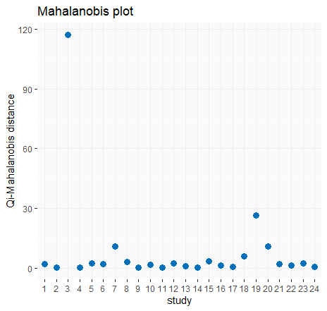
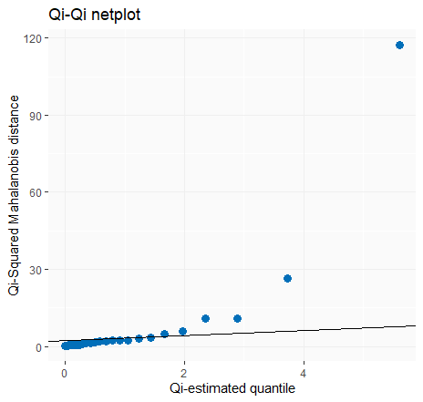
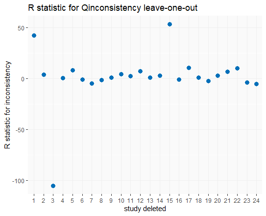

[](https://cran.r-project.org/package=NMAoutlier)
[](https://cran.r-project.org/package=NMAoutlier)
[](http://cranlogs.r-pkg.org/badges/NMAoutlier)
[](http://cranlogs.r-pkg.org/badges/grand-total/NMAoutlier)
[](https://travis-ci.org/petropouloumaria/NMAoutlier)


```{r setup, include=FALSE}
knitr::opts_chunk$set(echo = TRUE)
```

## Description

A package that provides measures and methodologies for detecting outlying and influential studies in network meta-analysis.

-   **1) Simply outlier and influential detection measures:** Raw, Standardized,
    Studentized residuals; Mahalanobis distance and leverage.
-    **2) Outlier and influential detection measures by considering a study
    deletion (Shift the mean):** Raw, Standardized, Studentized deleted residuals; Cook
    distance; COVRATIO; weight “leave one out”; leverage “leave one
    out”; heterogeneity “leave one out”; R heterogeneity; R Qtotal; R
    Qheterogeneity; R Qinconsistency and DFBETAS.
-   Plots for all the above outlier and influential detection measures (simple and deletion  
    measures) and Q-Q plot for network meta-analysis.
-   **3) Forward search algorithm in network meta-analysis (FS).**
-   Forward plots (fwdplot) for the monitoring measures in each
    step of forward search algorithm. Monitoring measures: P-scores; z-values for difference
    of direct and indirect evidence with back-calculation method;
    Standardized residuals; heterogeneity variance estimator; cook
    distance; ratio of variances; Q statistics.
-   Forward plot for summary estimates and their confidence
    intervals for each treatment in each step of forward search
    algorithm.  


## Installation

You can install the **NMAoutlier** package from GitHub repository as follows:

Installation using R package **[devtools](https://cran.r-project.org/package=devtools)**:

```{r, eval=FALSE}
install.packages("devtools")
devtools::install_github("petropouloumaria/NMAoutlier")
```

## Usage

Example of network meta-analysis comparing the relative effects of four smoking 
cessation counseling programs, no contact (A), self-help (B), individual counseling (C) and group counseling (D). 
The outcome is the number of individuals with successful smoking cessation at 6 to 12 months.
The data are in contrast format with odds ratio (OR) and its standard error. 
Arm-level data can be found in Dias et al. (2013).

Reference:

Higgins D, Jackson JK, Barrett G, Lu G, Ades AE, and White IR. Consistency and inconsistency in network meta-analysis:
concepts and models for multi-arm studies. Research Synthesis Methods 2012, 3(2): 98–110.

Dias S, Welton NJ, Sutton AJ, Caldwell DM, Lu G, and Ades AE. Evidence Synthesis for
Decision Making 4: Inconsistency in networks of evidence based on randomized controlled trials.
Medical Decision Making 2013, 33: 641–656.


You can load the **NMAoutlier** library
```{r, eval=FALSE}
library(NMAoutlier)
```


Load the dataset smoking cessation from **netmeta** package.

```{r, eval=FALSE}
data(smokingcessation, package = "netmeta")
```

Transform data from arm-based to contrast-based format using the function **pairwise** from **netmeta** package.
```{r, eval=FALSE}
library(netmeta)
p1 <- pairwise(list(treat1, treat2, treat3),
              list(event1, event2, event3),
              list(n1, n2, n3),              
              data=smokingcessation,
              sm="OR")
```


**Part 1: Simply outlier detection measures**


You can calculate simply outlier and influential detection measures with **NMAoutlier.measures** function as follows:
```{r, eval=FALSE}
measures <- NMAoutlier.measures(p1)
```

You can see the Mahalanobis distance for each study
```{r, eval=FALSE}
measures$Mahalanobis.distance
```

You can plot the Mahalanobis distance for each study with  **measplot** function as follows:
```{r, eval=FALSE}
measplot(measures, "mah")
```


You can figure out the Q-Q plot for network meta-analysis with **Qnetplot** function as follows:
```{r, eval=FALSE}
Qnetplot(measures)
```


**Part 2: Outlier detection measures considered deletion (Shift the mean)**


You can calculate outlier and influential detection measures considered study deletion with **NMAoutlier,measures** function as follows:
```{r, eval=FALSE}
deletion <- NMAoutlier,measures(p1, measure = "deletion")
```

You can see the standardized deleted residuals for each study
```{r, eval=FALSE}
deletion$estand.deleted
```

You can see the COVRATIO for each study
```{r, eval=FALSE}
deletion$Covratio
```

You can plot the R statistic for Qinconsistency with function **measplot** as follows:
```{r, eval=FALSE}
measplot(deletion, "rqinc", measure = "deletion")
```


**Part 3: Forward Search Algorithm - (Outlier detection Methodology)**


You can conduct the Forward Search algorithm with **NMAoutlier** function as follows: 
```{r, eval=FALSE}
FSresult <- NMAoutlier(p1, small.values = "bad")
```


You can see the forward plots with **fwdplot** function for Cook distance as follows:
```{r, eval=FALSE}
fwdplot(FSresult,"cook")
```


Or you can plot the Ratio of variances as follows:
```{r, eval=FALSE}
fwdplot(FSresult,"ratio")
```


You can plot the differences of direct and indirect estimates (z-values) as follows:
```{r, eval=FALSE}
fwdplot(FSresult,"nsplit")
```


You can see the forward plots for summary relative treatment estimates of B, C and D versus the reference A with **fwdplotest** function as follows: 
```{r, eval=FALSE}
fwdplotest(FSresult)
```


