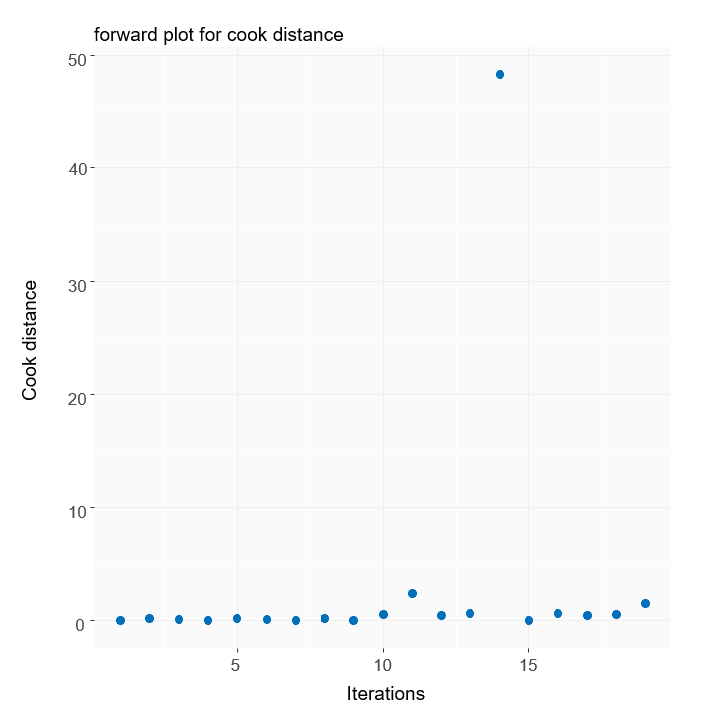
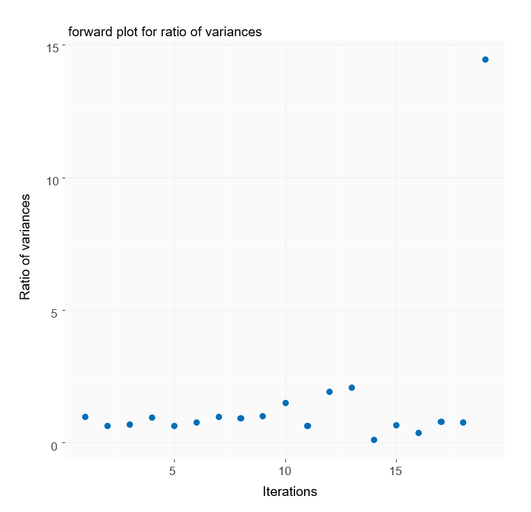
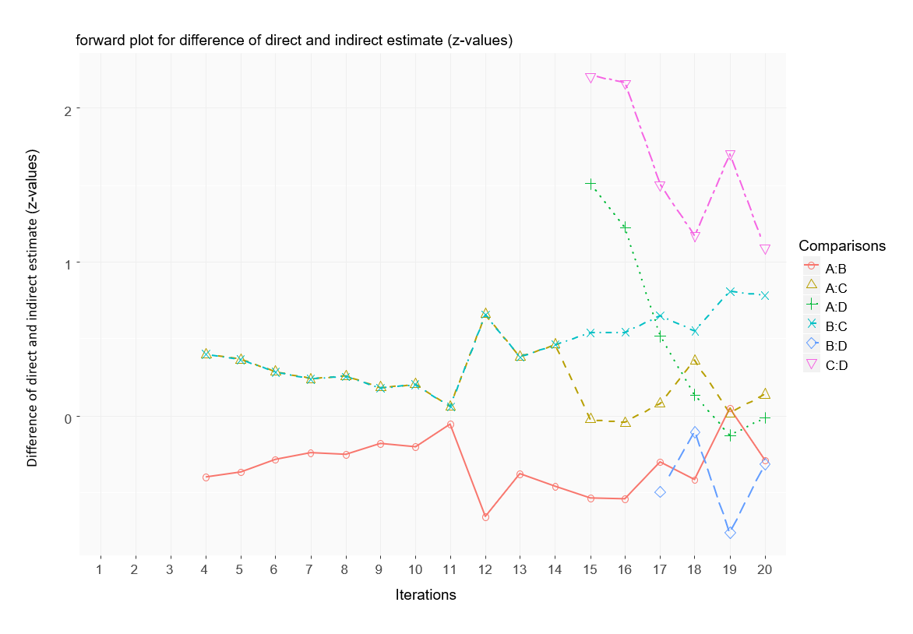
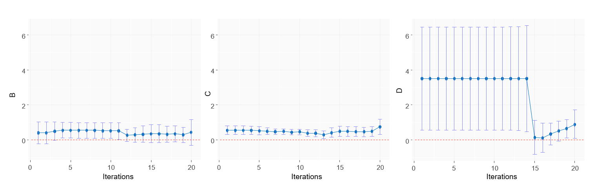

[](https://travis-ci.org/petropouloumaria/NMAoutlier)


```{r setup, include=FALSE}
knitr::opts_chunk$set(echo = TRUE)
```

## Description

A package that provides forward search algorithm for detecting outlying or influential studies in network meta-analysis.

- Provides the length of the initial oultying-free clean subset for forward search algorithm.
- Iterations of forward search algorithm.
- Basic set of studies in each iteration of forward search algorithm.
- Summary estimates and their confidence intervals in each iteration of forward search algorithm.
- Outlier and influential case diagnostics measures. 
- Ranking measures.
- Heterogeneity and inconsistency measures.
- Forward plots for summary estimates and their confidence intervals.
- Forward plots for monitored measures: outlier and influential case diagnostics measures, ranking measures, heterogeneity and inconsistency measures.

## Installation

You can install the **NMAoutlier** package from GitHub repository as follows:

Installation using R package **[devtools](https://cran.r-project.org/package=devtools)**:

```{r, eval=FALSE}
install.packages("devtools")
devtools::install_github("petropouloumaria/NMAoutlier")
```

## Usage

Example of outlying detection in network meta-analysis comparing the relative effects of four smoking 
cessation counseling programs, no contact (A), self-help (B), individual counseling (C) and group counseling (D). 
The outcome is the number of individuals with successful smoking cessation at 6 to 12 months.
These data are in contrast format with effect size odds ratio (OR) and its standard error. 
Arm-level data can be found in Dias et al.(2013).

Reference: 
Dias S, Welton NJ, Sutton AJ, Caldwell DM, Lu G and Ades AE (2013). Evidence Synthesis for
Decision Making 4: Inconsistency in networks of evidence based on randomized controlled trials.
Medical Decision Making 33, 641–656.


You can load the **NMAoutlier** library
```{r, eval=FALSE}
library(NMAoutlier)
```


Load the dataset smoking cessation from netmeta package.

```{r, eval=FALSE}
data(smokingcessation, package = "netmeta")
```

Transform data from arm-based format to contrast-based format using the function pairwise from netmeta package.
```{r, eval=FALSE}
library(netmeta)
p1 <- pairwise(list(treat1, treat2, treat3),
              list(event1, event2, event3),
              list(n1, n2, n3),              
              data=smokingcessation,
              sm="OR")
```


You can conduct the forward search algorithm with function **NMAoutlier** as follows:
```{r, eval=FALSE}
FSresult <- NMAoutlier(p1, small.values = "bad")
```


You can see the forward plots with function **fwdplot** for monitoring measures. For example, you can plot the influential diagnostic measure Cook distance as follows:

```{r, eval=FALSE}
fwdplot(FSresult,"cook")
```



Or you can plot the ratio of variances as follows:

```{r, eval=FALSE}
fwdplot(FSresult,"ratio")
```



You can plot the differences of direct and indirect estimates (z-values) as follows:

```{r, eval=FALSE}
fwdplot(FSresult,"nsplit")
```



You can see the forward plots for summary estimates for each treatment B, C and D with function **fwdplotest**  as follows: 

```{r, eval=FALSE}
fwdplotest(FSresult)
```




