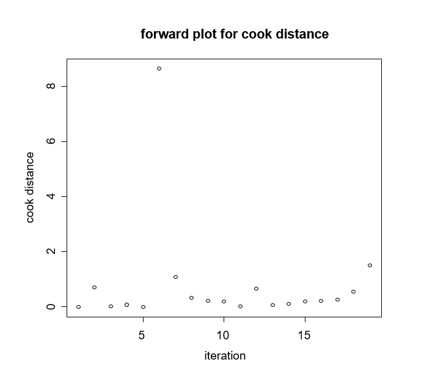
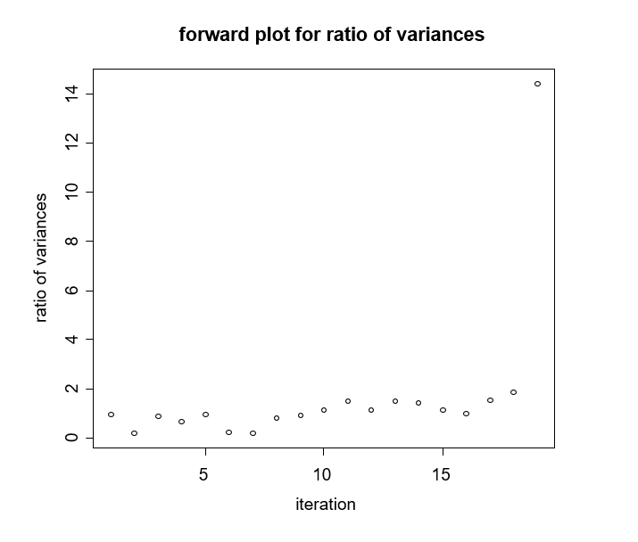
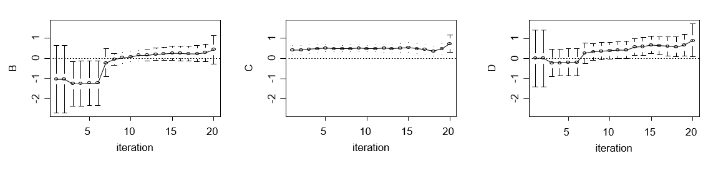

NMAoutlier: Forward Search Algorithm in Network Meta-Analysis to identify outlying and influential studies
================


Description
-----------

A package that provides forward search algorithm for detecting outlying or influential studies in network meta-analysis.

-   Provides the length of the initial oultying-free clean subset for forward search algorithm.
-   Iterations of forward search algorithm.
-   Basic set of studies in each iteration of forward search algorithm.
-   Summary estimates and their confidence intervals in each iteration of forward search algorithm.
-   Outlier and influential case diagnostics measures.
-   Ranking measures.
-   Heterogeneity and inconsistency measures.
-   Forward plots for summary estimates and their confidence intervals.
-   Forward plots for monitored measures: outlier and influential case diagnostics measures, ranking measures, heterogeneity and inconsistency measures.

Installation
------------

You can install the **NMAoutlier** package from GitHub repository as follows:

Installation using R package **[ghit](https://cran.r-project.org/package=ghit)** (without [Rtools](https://cran.r-project.org/bin/windows/Rtools/) for Windows):

``` r
install.packages("ghit")
ghit::install_github("petropouloumaria/NMAoutlier")
```

Installation using R package **[devtools](https://cran.r-project.org/package=devtools)** (with [Rtools](https://cran.r-project.org/bin/windows/Rtools/) for Windows):

``` r
install.packages("devtools")
devtools::install_github("petropouloumaria/NMAoutlier")
```

Usage
-----

Example of outlying detection in network meta-analysis comparing the relative effects of four smoking cessation counseling programs, no contact (A), self-help (B), individual counseling (C) and group counseling (D). The outcome is the number of individuals with successful smoking cessation at 6 to 12 months. These data are in contrast format with effect size odds ratio (OR) and its standard error. Arm-level data can be found in Dias et al.(2013).

Reference: Dias S, Welton NJ, Sutton AJ, Caldwell DM, Lu G and Ades AE (2013). Evidence Synthesis for Decision Making 4: Inconsistency in networks of evidence based on randomized controlled trials. Medical Decision Making 33, 641–656.

You can load the **NMAoutlier** library and the dataset and you can conduct the forward search algorithm with function **NMAoutlier** as follows:

``` r
library(NMAoutlier)
data(Dias2013)
FSresult <- NMAoutlier(TE, seTE, treat1, treat2, studlab, data=Dias2013)
```

You can see the forward plots with function **fwdplot** for monitoring measures. For example, you can plot the influential diagnostic measure Cook distance as follows:

``` r
fwdplot(FSresult,"cook")
```



Or you can plot the ratio of variances as follows:

``` r
fwdplot(FSresult,"ratio")
```



You can see the forward plots for summary estimates for each treatment B, C and D with function **fwdplotest** as follows:

``` r
fwdplotest(FSresult)
```


